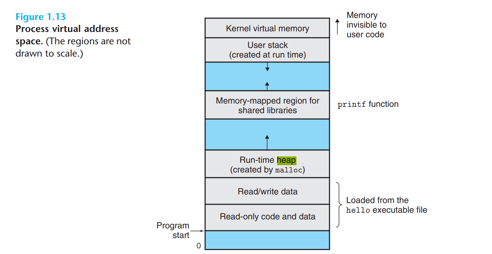

# 基础
## 1. 在main执行之前和之后的过程？

**补充**：

ELF（Executable Linkable Format）文件，可以归类为4类：
1. 可重定位文件（Linux下的`.o`，windows下的`.obj`）：包含代码和数据，可以被用来链接成可执行文件或共享目标文件。静态链接库也可以归为这一类。
2. 可执行文件（Linux`/bin/bash`下的文件，Windows下的`.exe`文件）：包含了可以直接执行的程序，代表就是ELF可执行文件，一般没有扩展名。
3. 共享目标文件（Linux下的`.so`文件，Windows下的`DLL`文件）：包含了代码和数据。两种用途：一种Linker使用该文件和其他可重定位文件链接，产生新的目标文件（静态链接）；第二种动态链接器将几个这种共享目标文件与可执行文件结合，作为进程映像的一部分来运行（动态链接）。
4. 核心转储文件（Linux下的core dump）：进程意外终止时，系统可以将该进程的地址空间的内容以及终止时的一些其他信息转储到核心转储文件。核心文件通常在系统收到特定的信号时由操作系统生成。信号可以由程序执行过程中的异常触发，也可以由外部程序发送。动作的结果一般是生成一个某个进程的内存转储的文件，文件包含了此进程当前的运行堆栈信息。

对于可重定位文件（*.o）、可执行文件、以及共享库（share library）三种文件格式从结构上来说基本一致，只是具体到每一个结构不同。地址从低往高依次为：

0. 文件头：包含整个文件的文件属性，如文件是否可执行，静态链接还是动态链接，入口地址（可执行文件），目标硬件，目标操作系统等信息。
1. 代码段（`.text`）：程序源代码编译后的机器指令。
2. 数据段（`.data`）：已初始化的全局变量和局部静态变量存放位置。
3. BSS段（`.bss`，Block Started by Symbol）：存放未初始化的全局变量和局部静态变量。未初始化的全局变量和局部静态变量的默认值都是0，本来可以放在`.data`段的，但是因为都是0，放在`.data`段分配空间并存放0是没有必要的。程序在运行的时候是要占内存空间的，并且可执行文件必须记录所有未初始化的全局变量和局部静态变量的大小总和，记为`.bss`段。所以`.bss`段只是为未初始化的全局变量和局部静态变量预留位置，并没有内容，在文件中不占据空间。

可以看到一个可执行程序至少包含：代码段 + 数据段 + BSS段。换句话说，一个可执行的二进制程序，在没有加载到内存中执行的时候，至少拥有三部分的数据，分别为代码段、数据段、BSS段。除此之外，还可能有其他段，和平台相关。

当程序加载到内存中执行的时候，此时需要另外两个域：堆和栈。

一个正在执行的C程序占用的内存区域分为代码段 + 数据段 + BSS段 +　堆 + 栈,共5个部分。

当可执行文件加载到内存空间执行的时候,操作系统负责**代码段,数据段和BSS段**的加载, 并在内存中为这些段分配空间。**栈**由操作系统管理,不需要程序员显示管理; **堆**由程序员管理, 显式地申请和释放。
1. 动态分配: Heap段。在程序运行时执行动态分配, 需要程序员显式管理(管理不当, 内存泄漏问题), 使用malloc和free。
2. 静态分配：编译时就已经确定好分配空间，代码段、数据段、BSS段和Stack段。静态分配的内存在进程结束时由操作系统释放（代码段、数据段和BSS段），栈上的数据则在函数返回后立即销毁。

总结：
1. 代码段：静态分配的内存在进程结束后由系统释放（Text+Data）,Stack 上的数据则在退出函数后立即被销毁。
2. 数据段：通常用来存放程序中已初始化的（非 0）全局变量和静态局部变量。数据段的起始位置由链接定位文件确认，大小在编译链接时自动分配。数据段属于静态内存分配
3. BSS段：通常用来存放程序中未初始化和初始化为 0的全局变量的一块内存区域，在程序载入时由内存清零。数据段属于静态内存分配。
4. 堆段：保存函数内部动态分配（malloc 或 new）的内存，是另外一种用来保存程序信息的数据结构。堆是先进先出（FIFO）数据结构。堆的地址空间是向上增加，即当堆上保存的数据越多，堆的地址越高。动态内存分配。注意：堆内存需要程序员手动管理内存，通常适用于较大的内存分配，如频繁的分配较小的内存，容易导致内存碎片化。
5. 栈段：栈保存函数的局部变量（不包括 static 修饰的变量），参数以及返回值。是一种后进先出（LIFO）的数据结构。在调用函数或过程后，系统会清除栈上保存的局部变量、函数调用信息及其他信息。栈的另外一个重要特征是，它的地址空间 向下减少，即当栈上保存的数据越多，栈的地址越低。静态内存分配注意，由于栈的空间通常比较小，一般linux 程序只有几 M，故局部变量，函数入参应该避免出现超大栈内存使用，比如超大结构体，数组等，避免出现 stack overflow

补充：
操作系统装载程序之后，首先运行的代码并不是main的第一行，而是某些特别的代码，这些代码准备好main函数执行说需要的环境，并且负责调用main函数，这时候你才可以再main函数里放心大胆的写各种代码：申请内存、使用系统调用、触发异常、访问IO。在main函数返回之后，他会记录main函数的返回值，调用atexit注册的函数，然后结束进程。
——《程序员的自我修养--链接、装载与库》

具体的：
`main()`执行之前：
1. 设置栈指针。
2. 初始化`.data`段的内容，即已初始化的全局变量和局部静态变量。
3. 默认初始化`.bss`段的内容，即未初始化的全局变量和局部静态变量。
4. 全局对象的初始化。
5. 将main函数的参数`argc`，`argv`等传递给`main`函数，然后真正开始执行`main`函数。
6. `__attribute__((constructor))`: The `constructor` attribute causes the function to be called automatically before execution enters `main ()`. Similarly, the destructor attribute causes the function to be called automatically after `main ()` completes or `exit ()` is called. Functions with these attributes are useful for initializing data that is used implicitly during the execution of the program.

`main()`执行之后：
1. 全局对象的析构函数。
2. 如果程序中使用`atexit(cleanup_function1);`注册了函数，则函数`cleanup_function1`会在`main()`执行结束之后执行。
在main()函数退出之后，一般不会有语句继续执行，但是如果我们使用atexit()函数，事先注册一个无返回值、无参数的函数，就可以在main()函数退出之后，继续执行我们注册的函数中的任务，用来保证一些资源的使用或清理等操作，就类似C++中的析构函数一般，不一样的是atexit()是在程序结束后，进行执行的。
3. `__attribute__((destructor))`。

## 